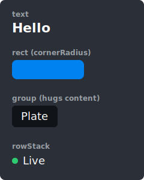
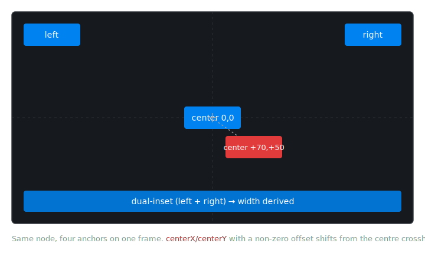
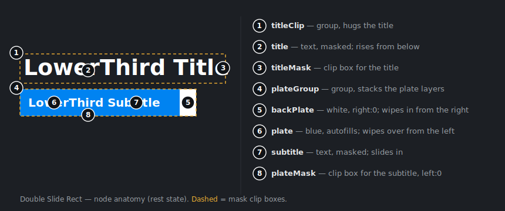
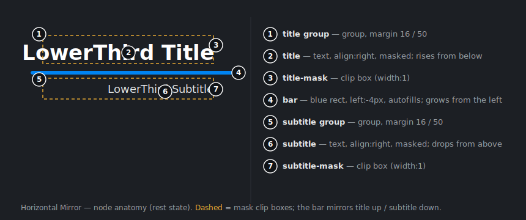

# Custom Overlays - Captions & Lower Thirds

Custom overlays let you build your own captions and lower thirds on top of the
video frame using the public `effects-sdk` API - no need to touch the SDK
internals. An overlay is a small declarative tree of primitives (**Group**,
**Stack**, **Text**, **Rect**) that the SDK lays out and renders over each
frame. Captions and lower thirds use the exact same model; the only difference
is the content and where the root sits in the frame.

You author an overlay once as an `OverlayDefinition`, then drive it at runtime
with `show()`, `hide()`, and `patch()`.

> Throughout this guide, `tsvb` is your initialized SDK instance.

## Importing the helpers

All builders and types live in the [`overlay`](https://effectssdk.ai/sdk/web/docs/modules/overlay.html)
namespace exported from `effects-sdk`. Unpack the builder functions once so the
examples below can stay short:

```ts
import { overlay } from "effects-sdk";

// Builder functions - unpack the ones you use:
const { text, rect, maskRect, group, rowStack, columnStack, pad } = overlay;

// Types live in the same namespace. Reference them with `overlay.X`,
// or alias the ones you use often:
type OverlayDefinition = overlay.OverlayDefinition;
type Node = overlay.Node;
```

The builders are pure convenience: every node is a plain object, and you can
write the tree by hand instead (see [Builders vs. plain objects](#22-builders-vs-plain-objects)).
The rest of this guide uses the unpacked names.

---

## 1. Quick start

This section takes you from nothing to an overlay visible on the frame.

### 1.1. A static overlay

The simplest useful overlay is a coloured plate with a line of text. It uses the
**background-plate pattern**: an auto-sized `group` that hugs its content, a
`rect` with no size that fills the group, and a `text` whose `margin` pushes the
plate outward to create padding. Here `left: "40px"` and `bottom: "40px"` place
the root in the bottom-left corner with a 40px offset.

```ts
const definition: OverlayDefinition = {
  root: group({ id: "root", left: "40px", bottom: "40px" }, [
    rect(0x0083f1, { cornerRadius: 6 }),          // fills the group
    text("Jane Doe", {
      id: "title",
      margin: pad(10, 16),                        // 10px vertical, 16px horizontal
      style: { fill: 0xffffff, fontSize: 22, fontWeight: "600" },
    }),
  ]),
};
```

A few things to note:

- Give an `id` to any node you intend to `patch()` or animate later (here,
  `root` and `title`).
- `designWidth` is omitted, so it defaults to `1280` - see
  [Units](#units). Pixel lengths like `"40px"` are sized against that base and
  scale with the actual frame.


### 1.2. Register it with the SDK

A custom overlay is a standard SDK component, so it's created, added, shown,
hidden, and destroyed exactly like the others - see
[Components system](./Features-Usage-Examples.md#components-system) for the
shared mechanics. Create it through the SDK factory and add it by id:

```ts
const lt = tsvb.createComponent({
  component: "custom_overlay",
  options: { definition },
});
tsvb.addComponent(lt, "my-lt");
```

To remove it later:

```ts
lt.destroy();
delete tsvb.components["my-lt"];
```

`onLoaded` fires once the tree has been parsed. It runs asynchronously, so
attach listeners right after creating the component:

```ts
lt.onLoaded(() => console.log("overlay ready"));
```

### 1.3. Show and hide

```ts
lt.show();   // plays the `show` phase, or appears instantly if there is none
lt.hide();   // plays the `hide` phase, or a reversed `show` if `hide` is absent
```

Other lifecycle methods:

- `isVisible(): boolean`
- `onBeforeShow(cb)` / `onAfterShow(cb)` / `onBeforeHide(cb)` / `onAfterHide(cb)`

`onBeforeShow` / `onAfterShow` both fire synchronously the moment you call
`show()` - `onAfterShow` marks the entrance *starting*, not the animation
finishing, so it always runs (even if you immediately `hide()`). `onBeforeHide`
fires synchronously on `hide()`; `onAfterHide` fires when the exit animation
completes - or instantly if there is no `hide`/`show` phase to play. Interrupting
a running hide with `show()` suppresses its `onAfterHide`.

By default the quick-start overlay pops in instantly. To make the entrance feel
dynamic, give it a `show` phase. The full animation model is covered in
[2.5](#25-animation); here is the gist applied to the same overlay:

```ts
const dynamicQuickStartEntry: OverlayDefinition = {
  root: group({ id: "root", left: "40px", bottom: "40px" }, [
    rect(0x0083f1, { cornerRadius: 6 }),
    text("Jane Doe", {
      id: "title",
      margin: pad(10, 16),
      style: { fill: 0xffffff, fontSize: 22, fontWeight: "600" },
    }),
  ]),

  show: {
    duration: "700ms",
    tweens: [
      // Slide the plate in from the left. `to` is omitted, so it settles at its resting position.
      { target: "root", property: "right", from: 1, easing: "ease-out-quint" },

      // Fade the label in once the plate is nearly in place (0.4 * 700ms = 280ms).
      { target: "title", property: "alpha", from: 0, to: 1, delay: 0.4, easing: "ease-out-sine" },
    ],
  },
  // `hide` is omitted, so it plays the show in reverse: the label fades out
  // first, then the plate collapses back off to the left.
};
```


---

## 2. The `OverlayDefinition`

```ts
interface OverlayDefinition {
  root: GroupNode | StackNode;   // tree root, positions itself in the frame
  designWidth?: number;          // design-comp width "Npx" is sized for; default 1280
  show?: AnimationPhase;         // optional - overlay can be fully static
  hide?: AnimationPhase;         // optional - defaults to a reversed `show`
}
```

The `root` must be a container (`group` or `stack`). It positions itself inside
the **video frame** using its own inset fields - the root's "parent" is the
frame:

| Placement              | Root inset fields              |
| ---------------------- | ------------------------------ |
| bottom-left            | `{ left: 0, bottom: 0 }`       |
| bottom-right           | `{ right: 0, bottom: 0 }`      |
| top-left               | `{ left: 0, top: 0 }`          |
| centred                | `{ centerX: 0, centerY: 0 }`   |
| bottom-left, 2 % inset | `{ left: 0.02, bottom: 0.02 }` |

### 2.1. Nodes

There are four node kinds. They all share the common [`BaseNode`](https://effectssdk.ai/sdk/web/docs/interfaces/overlay.BaseNode.html)
fields (positioning, sizing, `alpha`, `margin`, `mask`, `visible`).

**Text** - a run of text.

```ts
text("Hello", { style: { fontSize: 24, fill: 0xffffff } });
```

Its size is intrinsic (measured from the text). Use `wordWrap` + a `width` for
multi-line text, and `breakWords` to break long words. The full `TextStyle`:

```ts
interface TextStyle {
  fontFamily?: string | string[];   // one family or a fallback list
  fontSize?: number;                // design px (scaled with designWidth)
  fontWeight?: "100" | "200" | ... | "900" | "normal" | "bold";
  fontStyle?: "normal" | "italic";
  fill?: Color;                     // 0xRRGGBB
  letterSpacing?: number;           // design px
  lineHeight?: number;              // design px
  align?: "left" | "center" | "right";
  wordWrap?: boolean;               // wrap at the node's width
  breakWords?: boolean;             // break long words when wrapping
}
```

> Font loading is on you: register the font (CSS / `@font-face`) before creating
> the overlay. The SDK does not load fonts for custom overlays.

**Rect** - a filled rectangle.

```ts
rect(0x0083f1, { cornerRadius: 8 });
```

If you set `width`/`height`, it uses that size. If you omit them, **the rect
fills its parent** - the basis of the background-plate pattern.

**Group** - a structural container with no visuals of its own. Unlike a stack, a
group does **not** flow its children: every child is placed independently in the
**same box** and they **overlap**, stacked back-to-front in declaration order
(the first child is drawn at the bottom, the last on top). That overlap is what
the background-plate pattern relies on - a `rect` declared first, the `text`
layered on top.

```ts
group({ width: "200px", height: "60px" }, [ /* children */ ]);
```

With an explicit `width`/`height` it has that size and its children don't affect
it. With them omitted it **hugs its children's bounding box, including each
child's `margin`**. A group has no container-level padding - give a child
`margin` to create breathing room.

**Stack** - a linear layout that lays children out in sequence.

```ts
rowStack({ gap: "8px" }, [ icon, text("Live") ]);     // left -> right
columnStack({ gap: "4px" }, [ title, subtitle ]);     // top -> bottom
```

On the **flow axis** an auto-sized stack hugs the sum of child sizes plus gaps;
on the **cross axis** it hugs the largest child. `align`
(`start | center | end | stretch`, default `stretch`) controls cross-axis
placement. See [Positioning inside a stack](#positioning-inside-a-stack) for the
full slot model.

**When to use which:** reach for a **Group** when you place children by hand or
need the background-plate pattern; reach for a **Stack** when you want children
to flow with consistent gaps.

The four primitives side by side - Text measures its content, Rect takes an
explicit size and corner radius, Group hugs its child plus the child's margin,
and a rowStack flows a dot next to a label:



The **background-plate pattern** is the most common composition: a `group` that
hugs a single `text`, a `rect` declared first so it fills the group *behind* the
text, and the text's `margin` becoming the inner padding between the text and the
plate edge. Grow the margin and the plate grows with it:


**Group and Stack together.** A real lower third usually combines both: a `group`
background plate that hugs its content, wrapping a `rowStack` that flows an accent
bar next to a `columnStack` of title and subtitle. The plate `rect` sits at the
back of the group; the stacks lay the rest out with consistent gaps on top:


```ts
const lowerThird: OverlayDefinition = {
  root: group({ left: "40px", bottom: "40px" }, [
    rect(0x101317, { cornerRadius: 8 }),               // background plate, fills the group
    rowStack({ gap: "12px", margin: pad(14, 18) }, [   // margin -> inner padding
      rect(0x0083f1, { width: "4px" }),                // accent bar, autofills full height
      columnStack({ gap: "2px" }, [
        text("Jane Doe",         { style: { fill: 0xffffff, fontSize: 22, fontWeight: "600" } }),
        text("Product Designer", { style: { fill: 0x9aa0a6, fontSize: 16 } }),
      ]),
    ]),
  ]),
};
```

No `id`s or animation yet - those come later, once we cover
[`patch()`](#24-updating-at-runtime-with-patch) and
[animation](#25-animation).

### 2.2. Builders vs. plain objects

Every builder returns a plain object. Using the helpers and writing the JSON-like
tree by hand are **exactly equivalent** - pick whichever reads better:

```ts
// With builders:
group({ left: 0, bottom: 0 }, [
  rect(0x0083f1),
  text("Title", { margin: pad(10, 20), style: { fill: 0xffffff, fontSize: 22 } }),
]);

// The same node as a plain object:
{
  type: "group", left: 0, bottom: 0, children: [
    { type: "rect", fill: 0x0083f1 },
    {
      type: "text", text: "Title",
      margin: { top: "10px", right: "20px", bottom: "10px", left: "20px" },
      style: { fill: 0xffffff, fontSize: 22 },
    },
  ],
}
```

How the builders map:

| Builder                       | Produces                                   |
| ----------------------------- | ------------------------------------------ |
| `text(text, args?)`           | `{ type: "text", text, ...args }`          |
| `rect(fill, args?)`           | `{ type: "rect", fill, ...args }`          |
| `maskRect(args)`              | `{ type: "rect", isMask: true, ...args }`  |
| `group(args, children?)`      | `{ type: "group", ...args, children }`     |
| `rowStack(args, children?)`   | `{ type: "stack", direction: "row", ... }` |
| `columnStack(args, children?)`| `{ type: "stack", direction: "column", ...}`|

The defining attribute (`text`, `fill`) is the first positional argument;
everything else goes in the props object. `pad` is a shorthand for [`Padding`](https://effectssdk.ai/sdk/web/docs/types/overlay.Padding.html):

- `pad(16)` -> `"16px"` on all sides.
- `pad(10, 16)` -> vertical `10px`, horizontal `16px` (CSS-style shorthand).
- `pad({ left: 40 })` -> only the sides you name.

### 2.3. Positioning and sizing

The same node lands in four different places depending on which anchor it picks -
and `centerX` / `centerY` take a signed offset, so a non-zero value shifts the
node *off* the centre rather than pinning it dead-centre:



```ts
{ left: "16px",  top: "16px" }                  // pinned to the top-left
{ right: "16px", top: "16px" }                  // pinned to the top-right
{ centerX: 0, centerY: 0 }                      // dead centre
{ centerX: "70px", centerY: "50px" }            // 70px right, 50px below centre
{ left: "16px", right: "16px", bottom: "16px" } // both insets -> width derived
```

#### Picking a field per axis

Each axis is positioned by exactly one field. The field you pick is also the
**anchor**:

| Axis | Pick one of            | Anchors to                 |
| ---- | ---------------------- | -------------------------- |
| X    | `left`                 | parent's left edge         |
| X    | `right`                | parent's right edge        |
| X    | `centerX`              | parent's horizontal centre |
| Y    | `top`                  | parent's top edge          |
| Y    | `bottom`               | parent's bottom edge       |
| Y    | `centerY`              | parent's vertical centre   |

`right: "20px"` means "right-anchored, 20px in from the parent's right edge".
`centerX`/`centerY` is `0` for perfectly centred, with a signed offset from the
centre. If you set an inset on an axis, `centerX`/`centerY` on that axis is
ignored. The default when nothing is set is `left: 0` / `top: 0`.

```ts
{ left: "10px", top: "5px" }      // 10 x 5 from the top-left
{ right: "20px", bottom: "20px" } // 20 x 20 in from the bottom-right
{ centerX: 0, centerY: 0 }        // perfectly centred
{ centerX: 0, top: "10px" }       // centred horizontally, 10px from the top
```

#### Both insets on one axis (derived size)

You may set **both** insets on an axis (`left` + `right`, or `top` + `bottom`).
Both edges are pinned and the size on that axis is **derived** from the parent:

```ts
{ left: "20px", right: "20px" }   // width = parentWidth - 20 - 20
```

The derived size wins over an explicit `width` on that axis. `minWidth` /
`maxWidth` still clamp the result (see below).

#### Size fields

- `width` / `height`: a fraction (`0.5` or `"50%"`) of the parent, or `"Npx"`
  design pixels. Omit them to fall back to the node's natural sizing rule (Text
  measures its content; Rect fills the parent; Group/Stack hug their children).
- `minWidth` / `minHeight` / `maxWidth` / `maxHeight`: clamps on the computed
  size. They **always** apply - to auto-sized nodes, explicit sizes, and
  derived dual-inset sizes alike. They are not animatable; animate `width` /
  `height` if you need a size tween.

> **Fractional sizes inside an auto-sized parent.** A child's fractional
> `width`/`height` (a number or `"N%"`) on an auto-sized axis does **not**
> contribute to the parent's hug - that would be circular (the parent's size
> depends on the child and vice versa). The parent sizes from its `"Npx"` and
> intrinsic children, and the fraction then resolves against the parent's
> final size at layout - e.g. a `width: 1` rect fills a text-hugged group
> without inflating it. The same applies to fractional `minWidth`/`minHeight`.

#### Units

[`Length`](https://effectssdk.ai/sdk/web/docs/types/overlay.Length.html) has three forms:

- **`number`** - a fraction of the parent dimension (`0.5` = 50 %).
- **`"N%"`** - the same fraction written the CSS way (`"50%"`).
- **`"Npx"`** - design pixels, scaled to the frame as
  `actualPx = N * frameWidth / designWidth`.

`designWidth` (default `1280`) is the design-comp width you author against - set
it to `1920` if you design at 1080p. Bare numbers used for `fontSize` and
`cornerRadius` are always treated as design pixels and scale the same way. Because `"Npx"` scales with the frame, an overlay authored once
looks proportionally identical at any render size.

#### Positioning inside a stack

A stack gives each child a **slot**: its flow extent is the child's allocation,
its cross extent is the stack's full inner cross span. Inside that slot the
child's own positional and size fields apply - insets, `centerX`/`centerY`,
explicit `width`/`height`, and min/max clamps all work - plus two
stack-specific behaviours: `align` (default cross placement) and cross-axis
autofill. Fractional insets and `centerX`/`centerY` resolve against the slot;
fractional `width`/`height` (and `min`/`max`) resolve against the stack's full
inner size.

Size on each axis, in priority order:

1. Both insets on the axis -> `slot - inset - inset`.
2. Explicit `width`/`height`.
3. A single inset with autofill -> `slot - inset`.
4. Autofill (no inset, no explicit size) -> the full slot.
5. Intrinsic size.

Autofill applies to rects always, and to non-rect children only when nothing
pins the axis - no inset, no `centerX`/`centerY` (on the cross axis
`align: "stretch"`, the default, is additionally required). A single inset
anchors a non-rect at its intrinsic size - as in a group - while a rect still
autofills from the anchor. `min`/`max` constraints do not change the regime -
they clamp the autofilled size like any other computed size.

`margin` is added to the slot on both sides and **compounds with `gap`**: two
adjacent children with `margin: "10px"` and a `gap: "5px"` between them produce a
25px visual gap (10 + 5 + 10).

#### Positioning inside a group

A group gives **every** child the same slot: the group's full inner box. Children
overlay in declaration order instead of flowing, so a group is how you stack a
plate, a mask, and text in the same place. Inside that box the child's own
positional and size fields apply - insets, `centerX`/`centerY`, explicit
`width`/`height`, and min/max clamps.

Size on each axis, in priority order:

1. Both insets on the axis -> `box - inset - inset` (any node).
2. Explicit `width`/`height` (any node).
3. A single inset, **rect only** -> autofills from that anchor to the opposite
   edge (`box - inset`). A non-rect (text, group, stack) with a single inset
   keeps its intrinsic size and is merely *anchored* by the inset.
4. Autofill (no inset, no explicit size) -> the full box.
5. Intrinsic size.

A child is in one of two regimes on each axis. **Autofill** stretches it to the
whole box (or, for a rect with one inset, from that anchor to the opposite edge);
it applies to rects always, and to non-rect children only when nothing pins the
axis - no inset, no `centerX`/`centerY`, no explicit size. `min`/`max`
constraints do not change the regime - they clamp the autofilled size like any
other computed size. Otherwise the child is **anchored**: it takes its intrinsic (or explicit)
size and is placed by its inset / center. So a single inset stretches a **rect**
but only *moves* a **text** (the text stays its intrinsic width). The group itself **hugs the bbox** of its
children (auto-sizes to the widest / tallest) unless you give it an explicit size
or dual insets.

> **A tween can add an anchor.** A positional tween writes an inset, and an inset
> *is* an anchor - so a text that rests in the autofill regime (no inset,
> positioned by `margin` or a stack) becomes **anchored** for the duration of the
> animation: it collapses from the full box to its intrinsic width and is re-placed
> by the tweened inset, then snaps back when it settles to the autofill base.
> Animating the edge *opposite* the text's resting anchor is the usual trigger.

### 2.4. Updating at runtime with `patch`

`patch(nodeId, partial)` is the single entry point for mutating a live node by
`id`. It covers text and colour changes, restyling, and move/resize via
`patch("root", { left: "80px", width: "320px" })`.

```ts
lt.patch("title", { text: "New name" });
lt.patch("title", { style: { fill: 0xffcc00 } });
lt.patch("root", { bottom: "80px" });
```

Patchable fields (a loose union across node kinds - each is validated against the
target's type):

- **Position:** `left`, `right`, `centerX`, `top`, `bottom`, `centerY` (one per
  axis).
- **Size:** `width`, `height`, `minWidth`, `minHeight`, `maxWidth`, `maxHeight`.
- **Any node:** `alpha`, `visible`, `margin`.
- **Stack:** `gap`, `align`, `direction`.
- **Text:** `text`, `style`.
- **Rect:** `fill`, `cornerRadius`.

Not patchable: `id` and `type` (immutable identity), `children` (the tree
structure is fixed - recreate the overlay for a different layout), and
`mask` / `isMask` (mask wiring is structural; animate the clip by patching the
mask rect's dimensions instead). Passing a field that doesn't apply to the target
node - `text` on a non-Text, `fill` on a non-Rect - throws.

**Interaction with animation.** A `patch()` that lands while a tween is in flight
updates the node's **base** (resting) value; it does not retarget the running
tween. The in-flight tween keeps playing and the patched value takes effect when
the phase settles (see [Settling](#phase-rules)). So patching `text` mid-show
plays smoothly and lands on the new text.

### 2.5. Animation

An overlay has up to two phases, `show` and `hide`. Each has a total `duration`
and a flat list of `tweens` that reference nodes by `id`:

```ts
interface AnimationPhase {
  duration: AbsoluteDuration;   // "1000ms" or "0.8s"
  tweens: Tween[];
  onComplete?: (reason: "show" | "hide" | "interrupted") => void;
}
```

If `show` is absent the overlay appears instantly; if `hide` is absent it plays a
reversed `show`.

`onComplete` fires when the phase's animation ends, and the `reason` reports
how: `"show"` (finished playing forward as a show), `"hide"` (finished as a
hide - an authored `hide`, or the implicit reverse of `show`), or
`"interrupted"` (cut short by a new `show()`/`hide()` or a teardown). Because
an omitted `hide` replays the `show` phase backwards, it is the **`show`
phase's** `onComplete` that fires with `"hide"` when that reverse finishes.

#### Tween

A single tween animates one `property` of one node. It is the time-varying
counterpart of [`patch`](#24-updating-at-runtime-with-patch): where
`patch("title", { left: "80px" })` overrides a property **once**, a tween
overrides that same property **every frame** over its window, stepping the value
from `from` to `to` along an `easing` curve. It writes the exact same property
slot `patch` does - there is no separate animation layer - so when the phase ends
the property settles back to the node's base value (the value a `patch` last set,
or the declared default; see [Settling](#phase-rules)).

Every tween has `target` (the node id), `property`, optional `from`, `to`,
`delay`, `duration`, and `easing`. Defaults: `from` is the property's current
value when the tween starts; `to` is the node's declared base value.

#### Tween kinds

- **Positional** - `left`, `right`, `centerX`, `top`, `bottom`, `centerY`,
  `width`, `height`. `from`/`to` use `Length` semantics.
- **Scalar** - `alpha`, a raw number `0..1`.
- **Colour** - `fill` on a Rect; R, G, and B interpolate independently.

#### Value semantics (positional)

`from`/`to` read as "distance from the anchored edge", so the meaning of `1`
and `-1` depends on which field you animate:

| value    | meaning                                                  |
| -------- | -------------------------------------------------------- |
| `0`      | flush with the anchored edge (or exactly on the centre)  |
| `1`      | one full parent dimension inward from that edge          |
| `-1`     | one full parent dimension outward (off-screen)           |
| `"50%"`  | half the parent dimension                                |
| `"40px"` | design pixels, scaled with `designWidth`                 |

The classic slide-in entrance: declare the node at its resting position and tween
`from` an off-screen value, letting `to` default to the base:

```ts
// Node rests 20px in from the right edge:
text("Title", { id: "title", right: "20px" });

// In show.tweens - fly in from off-screen right:
{ target: "title", property: "right", from: -1, easing: "ease-out-quint" }
```


<details>
<summary>The overlay behind that animation</summary>

A white-text plate anchored bottom-right that flies in from off-screen. The
`right` tween starts `from: -1` and omits `to`, so it settles at the declared
base (`right: "40px"`). Here the tween drives the **root** rather than the
`title` node, so `-1` is one full *frame*-width (the root's parent is the frame)
and the plate travels all the way in from off-screen; on a small inner node
`from: -1` would only span its narrow parent - see
[`relativeTo`](#relativeto---placing-against-another-node) for flying a nested
node fully off the frame. With `hide` omitted, the plate slides back off to the
right.

```ts
const slideIn: OverlayDefinition = {
  root: group({ id: "root", right: "40px", bottom: "40px" }, [
    rect(0x0083f1, { cornerRadius: 6 }),
    text("Title", {
      id: "title",
      margin: pad(10, 16),
      style: { fill: 0xffffff, fontSize: 22, fontWeight: "600" },
    }),
  ]),

  show: {
    duration: "700ms",
    tweens: [
      { target: "root", property: "right", from: -1, easing: "ease-out-quint" },
    ],
  },
};
```

</details>

#### `relativeTo` - placing against another node

Use the object form `{ value, relativeTo }` to place the animated edge at an
absolute coordinate **inside a reference node's box**, instead of measuring
against the immediate parent:

```ts
// Start one full frame-width off the left edge, regardless of tree depth:
{ target: "subtitle", property: "left",
  from: { value: -1, relativeTo: "frame" } }

// Start off a named ancestor's box:
{ target: "accent", property: "top",
  from: { value: -1, relativeTo: "card" } }
```

`relativeTo: "frame"` is the reserved token for the video frame; any other string
is a node `id`. `value` is multiplied by the reference's size on the tween's axis
and added to its leading edge: `0` = the reference's leading (left/top) edge,
`1` = its trailing edge, `-1` = one reference-size before the leading edge,
`"50%"` = its middle. The reference is resolved **once at tween start** - later
resizes don't retarget an in-flight tween. This is the reliable way to fly a
deeply-nested node fully off the frame, since a plain `from: -1` only travels one
(possibly narrow) parent width.

```ts
// Park a node just off an edge, flush (`to` omitted -> settles to base). Push the
// node's far edge onto the frame's near edge, so the throw equals the node's width:
{ target: "card", property: "right", from: { value: 0, relativeTo: "frame" } } // right edge at frame-left  -> off-left
{ target: "card", property: "left",  from: { value: 1, relativeTo: "frame" } } // left edge at frame-right  -> off-right
```

(Use `value: -1` on the same edge - e.g. `left` - instead if you want it flung a
full frame-width out regardless of node width.)

#### Timing: `delay` and `duration`

Relative values (a plain number `0..1`) are fractions of the phase `duration`;
absolute values are strings. Within a 1000ms phase:

| field               | meaning                              |
| ------------------- | ------------------------------------ |
| `delay: 0.5`        | starts at 500ms (0.5 * 1000ms)       |
| `delay: "200ms"`    | starts at 200ms                      |
| `duration: 0.25`    | runs for 250ms (0.25 * 1000ms)       |
| `duration` omitted  | runs from `delay` to the phase end   |
| `duration: "300ms"` | runs 300ms (may finish before phase) |

`delay` holds the property at `from` until it elapses; the easing curve then
plays in full over the tween's own length. So `delay: 0.5` with no `duration` on
a 1000ms phase is a 500ms tween that starts halfway through - visually identical
to a 500ms phase with no delay, just shifted later. Stagger several tweens with
different `delay`s for choreographed entrances.

Available easings: `linear`, `ease-out-sine`, `ease-out-quint`, `ease-out-cubic`,
`ease-in-sine`, `ease-in-quint`, `ease-in-cubic`. Use `ease-out-*` for entrances;
`ease-in-*` is mainly for an authored `hide` (which plays forward).


<details>
<summary>The overlay behind that animation</summary>

The [combined group + stack lower third](#21-nodes) with a `show` phase whose
pieces arrive on a cascade of `delay`s - the plate fades in, the accent bar
grows, then the title and subtitle slide in and fade one after another. Because
`hide` is omitted, the same cascade plays in reverse to dismiss.

```ts
const stagedChoreography: OverlayDefinition = {
  root: group({ left: "40px", bottom: "40px" }, [
    rect(0x101317, { id: "plate", cornerRadius: 8 }),         // background plate
    rowStack({ gap: "12px", margin: pad(14, 18) }, [
      rect(0x0083f1, { id: "bar", width: "4px", centerY: 0 }), // accent bar, grows from its centre
      columnStack({ gap: "2px" }, [
        text("Jane Doe",         { id: "title",    style: { fill: 0xffffff, fontSize: 22, fontWeight: "600" } }),
        text("Product Designer", { id: "subtitle", style: { fill: 0x9aa0a6, fontSize: 16 } }),
      ]),
    ]),
  ]),

  show: {
    duration: "1200ms",
    tweens: [
      // 1. The plate fades in first (0 -> 300ms).
      { target: "plate",    property: "alpha",  from: 0,      duration: 0.25, easing: "ease-out-sine" },
      // 2. The accent bar grows from its centre (240 -> 600ms).
      { target: "bar",      property: "height", from: 0,      delay: 0.2, duration: 0.3,  easing: "ease-out-quint" },
      // 3. The title slides in and fades (360 -> ~800ms).
      { target: "title",    property: "left",   from: "20px", delay: 0.3, duration: 0.4,  easing: "ease-out-quint" },
      { target: "title",    property: "alpha",  from: 0,      delay: 0.3, duration: 0.35, easing: "ease-out-sine" },
      // 4. The subtitle follows last (600 -> ~1080ms).
      { target: "subtitle", property: "left",   from: "20px", delay: 0.5, duration: 0.4,  easing: "ease-out-quint" },
      { target: "subtitle", property: "alpha",  from: 0,      delay: 0.5, duration: 0.35, easing: "ease-out-sine" },
    ],
  },
};
```

</details>

#### Phase rules

These apply to both `show` and `hide`:

- **One tween per (target, property)** in a phase - a duplicate is a load-time
  error.
- **The target must exist** - an unknown `id` fails to load.
- **`duration: 0` snaps** instantly to `to` at `delay` time, then holds.
- **Settling.** When the phase ends, every tweened property snaps to the node's
  declared base value (as mutated by any `patch()`) - even if the tween's `to`
  was different. `to` is only a trajectory target during the phase; the base is
  the canonical resting state. This keeps repeated `show`/`hide` cycles
  idempotent.
- **A mid-phase `patch()` does not retarget tweens** - the patched base takes
  effect at the settle and on the next phase.

#### Reversing (`hide` from `show`)

When you omit `hide`, the overlay disappears by playing the `show` phase **in
reverse**, so the easing mirrors for free and repeated show/hide cycles stay
symmetric. Provide a `hide` and it plays **forward, as written**, as its own
timeline.

#### Masks (animated reveals)

A node clips itself to another node's bounds via `mask: "<id>"`, where the target
is a [`RectNode`](https://effectssdk.ai/sdk/web/docs/interfaces/overlay.RectNode.html) with `isMask: true` declared anywhere in the tree. A mask rect
lays out like any other rect but renders invisibly. Animate a reveal by giving
the mask an `id` and tweening its `width`/`height` or insets - here a small but
complete overlay whose title wipes in from the left:

```ts
const maskReveal: OverlayDefinition = {
  root: group({ left: "20px", bottom: "20px", width: "260px", height: "40px" }, [
    maskRect({ id: "titleMask" }),                  // fills the sized group
    text("Breaking news", {
      id: "title",
      mask: "titleMask",                            // clipped to titleMask's bounds
      style: { fill: 0xffffff, fontSize: 28, fontWeight: "600" },
    }),
  ]),

  show: {
    duration: "600ms",
    tweens: [
      // Wipe in: the mask grows from zero to the group's full width.
      { target: "titleMask", property: "width", from: 0, easing: "ease-out-cubic" },
    ],
  },
};
```

Put the mask inside an explicit-sized parent (as above) so its animated
dimensions don't drag the surrounding layout.


Insets change the direction of the reveal. With `centerX: 0` the mask is centred,
so it expands from the inside out:

```ts
maskRect({ id: "titleMask", centerX: 0 }),
```


Anchor it to an edge instead and the wipe starts there - `right: 0` reveals
right-to-left:

```ts
maskRect({ id: "titleMask", right: 0 }),
```


---

## Full examples

Two complete, worked overlays - each a port of a built-in lower third - that pull
together everything above: nested groups inside a stack, background-plate rects,
sprite-mask reveals, `relativeTo` tween endpoints, staged per-element delays,
off-screen entrances, an implicit `to` settling to the base, and an omitted
`hide` played as a reversed `show`.

### Double Slide Rect


```ts
const titleStyle    = { fontSize: 60, fill: 0xffffff, wordWrap: true, breakWords: true };
const subtitleStyle = { fontSize: 26, fill: 0xffffff, wordWrap: true, breakWords: true };

const definition: OverlayDefinition = {
  root: columnStack({ id: "root", bottom: "75px", left: "15px", align: "stretch" }, [
    // Title clipped by its own mask so it can rise into view from below.
    group({ id: "titleClip" }, [
      text("LowerThird Title", { id: "title", style: titleStyle, mask: "titleMask" }),
      maskRect({ id: "titleMask" }),
    ]),
    // Subtitle plate: white back-plate + blue front-plate, text revealed by a mask.
    group({ id: "plateGroup" }, [
      rect(0xffffff, { id: "backPlate", right: 0 }),  // white, anchored to the right
      rect(0x0083f1, { id: "plate" }),                // blue, autofills the box
      text("LowerThird Subtitle", {
        id: "subtitle",
        margin: pad({ left: 20, right: 5, top: 6, bottom: 6 }),
        style: subtitleStyle,
        mask: "plateMask",
      }),
      maskRect({ id: "plateMask", left: 0 }),
    ]),
  ]),
  show: {
    duration: "2.25s",
    tweens: [
      // 1. White back-plate grows in from the right (right-anchored width 0 -> full).
      { target: "backPlate", property: "width", from: 0,                                     duration: "650ms", easing: "ease-out-cubic" },
      // 2. Blue front-plate grows over it from the left once the back is laid.
      { target: "plate",    property: "width", from: 0,                     delay: "650ms",   duration: "650ms", easing: "ease-out-cubic" },
      // 3. Subtitle slides in and the title rises together, starting partway
      //    through the blue plate; the title runs a touch longer.
      { target: "subtitle", property: "right", from: { value: 0, relativeTo: "plateMask" }, delay: "1s", duration: "1.1s",  easing: "ease-out-quint" },
      { target: "title",    property: "top",   from: { value: 1, relativeTo: "titleMask" }, delay: "1s", duration: "1.25s", easing: "ease-out-quint" },
    ],
  },
};
```

**Layout.** The root is a [`columnStack`](#positioning-inside-a-stack) pinned to the
bottom-left. `align: "stretch"` makes both rows take the column's full width - the
wider title row sets that width, so the subtitle plate spans the same extent. Each
row is a [`group`](#positioning-inside-a-group) that overlays its children in the
same box:

- `titleClip` holds the `title` and a `titleMask`. The mask is a `maskRect` with
  no size, so it [autofills](#positioning-inside-a-group) the group box and clips
  the title to it - the title can sit *below* the box and stay hidden until it
  rises in.
- `plateGroup` stacks four children in paint (declaration) order: the white
  `backPlate` (anchored `right: 0`), the blue `plate` (autofills), the masked
  `subtitle`, and the `plateMask` that clips it.

**Animation** (2.25 s). The `from` endpoints use
[`relativeTo`](#relativeto---placing-against-another-node) so the entrances are
measured against the masks, and every `to` is omitted so each property settles to
its base:

1. `backPlate.width` grows `0 -> full`. It's right-anchored, so it unrolls leftward
   from the right edge.
2. `plate.width` grows `0 -> full` from the left, painting blue over the white -
   the white-back / blue-front flash of the built-in.
3. From `1s`, the `subtitle`'s right edge starts at the plate-mask's left edge
   (`value: 0` -> off to the left, hidden by the mask) and slides into place, while
   the `title`'s top edge starts one mask-height down (`value: 1` -> just below the
   clip) and rises in. There is no `hide`, so the exit replays this `show` in
   reverse.



### Horizontal Mirror


```ts
const titleStyle    = { fontSize: 70, fill: 0xffffff, align: "right", wordWrap: true, breakWords: true };
const subtitleStyle = { fontSize: 26, fontWeight: "100", fill: 0xffffff, align: "right", wordWrap: true, breakWords: true };

const definition: OverlayDefinition = {
  root: columnStack({ id: "root", bottom: "40px", align: "stretch", gap: "10px" }, [
    // bottom: -6 tightens the title->bar gap (the font box carries extra descent);
    // a negative margin only trims this group's flow slot, the bar/subtitle stay.
    group({ margin: pad({ left: 16, right: 50, bottom: -6 }) }, [
      text("LowerThird Title", { id: "title", style: titleStyle, mask: "title-mask", width: 1 }),
      maskRect({ id: "title-mask", width: 1 }),
    ]),
    rect(0x0083f1, { id: "bar", height: "6px", left: "-4px", cornerRadius: 4 }),
    group({ margin: pad({ left: 16, right: 50 }) }, [
      text("LowerThird Subtitle", { id: "subtitle", style: subtitleStyle, mask: "subtitle-mask", width: 1 }),
      maskRect({ id: "subtitle-mask", width: 1 }),
    ]),
  ]),
  show: {
    duration: "2000ms",
    tweens: [
      // Bar grows in from the left (its right edge starts at the frame's left edge).
      { target: "bar",      property: "right",  from: { value: 0, relativeTo: "frame" },         duration: 0.5, easing: "ease-out-quint" },
      // Once the bar is laid, the title rises and the subtitle drops - mirrored.
      { target: "title",    property: "top",    from: { value: 1, relativeTo: "title-mask" },    delay: 0.5, duration: 0.3, easing: "ease-out-quint" },
      { target: "subtitle", property: "bottom", from: { value: 0, relativeTo: "subtitle-mask" }, delay: 0.5, duration: 0.3, easing: "ease-out-quint" },
    ],
  },
};
```

**Layout.** The root `columnStack` is pinned to the bottom with a `10px` gap and
`align: "stretch"`, so each row spans the column width. Both texts are
right-aligned and given `width: 1` so they fill their group box and the glyphs
park at the right edge; each is clipped by a same-size `maskRect` (`width: 1`).
The group `margin` insets the rows (16px left, 50px right); the title group also
carries `bottom: -6` to pull it down against the font box's descent and tighten
the title-to-bar gap. The `bar` is a 6px
rect with `left: "-4px"`: a [single inset on a rect autofills](#positioning-inside-a-group)
from that anchor to the right edge, so it spans the row.

**Animation** (2000 ms). Again every endpoint is `relativeTo`-anchored and every
`to` is omitted:

- The `bar`'s right edge starts at the frame's left edge (`value: 0, relativeTo:
  "frame"`) and expands to base - the bar grows in from the left.
- From `0.5`, the `title`'s top edge starts one mask-height *below* its mask
  (`value: 1` -> hidden) and rises in, while the `subtitle`'s bottom edge starts at
  its mask's *top* (`value: 0` -> hidden above) and drops in. The two reveals
  mirror each other across the bar.



---

## API reference

**Authoring**

- [`overlay` namespace](https://effectssdk.ai/sdk/web/docs/modules/overlay.html) - all builders and types
- [`OverlayDefinition`](https://effectssdk.ai/sdk/web/docs/interfaces/overlay.OverlayDefinition.html)
- [`TextStyle`](https://effectssdk.ai/sdk/web/docs/interfaces/overlay.TextStyle.html)
- [`AnimationPhase`](https://effectssdk.ai/sdk/web/docs/interfaces/overlay.AnimationPhase.html)
- [`Tween`](https://effectssdk.ai/sdk/web/docs/types/overlay.Tween.html)

**Nodes & values**

- [`Node`](https://effectssdk.ai/sdk/web/docs/types/overlay.Node.html),
  [`BaseNode`](https://effectssdk.ai/sdk/web/docs/interfaces/overlay.BaseNode.html),
  [`GroupNode`](https://effectssdk.ai/sdk/web/docs/interfaces/overlay.GroupNode.html),
  [`StackNode`](https://effectssdk.ai/sdk/web/docs/interfaces/overlay.StackNode.html),
  [`RectNode`](https://effectssdk.ai/sdk/web/docs/interfaces/overlay.RectNode.html),
  [`TextNode`](https://effectssdk.ai/sdk/web/docs/interfaces/overlay.TextNode.html)
- [`Length`](https://effectssdk.ai/sdk/web/docs/types/overlay.Length.html),
  [`Padding`](https://effectssdk.ai/sdk/web/docs/types/overlay.Padding.html),
  [`Color`](https://effectssdk.ai/sdk/web/docs/types/overlay.Color.html),
  [`AbsoluteDuration`](https://effectssdk.ai/sdk/web/docs/types/overlay.AbsoluteDuration.html),
  [`NodePatch`](https://effectssdk.ai/sdk/web/docs/types/overlay.NodePatch.html)

**Builders**

- [`text`](https://effectssdk.ai/sdk/web/docs/functions/overlay.text.html),
  [`rect`](https://effectssdk.ai/sdk/web/docs/functions/overlay.rect.html),
  [`maskRect`](https://effectssdk.ai/sdk/web/docs/functions/overlay.maskRect.html),
  [`group`](https://effectssdk.ai/sdk/web/docs/functions/overlay.group.html),
  [`rowStack`](https://effectssdk.ai/sdk/web/docs/functions/overlay.rowStack.html),
  [`columnStack`](https://effectssdk.ai/sdk/web/docs/functions/overlay.columnStack.html),
  [`pad`](https://effectssdk.ai/sdk/web/docs/functions/overlay.pad.html)

**Component API**

- [`tsvb.createComponent`](https://effectssdk.ai/sdk/web/docs/classes/tsvb.html#createComponent)
- [`tsvb.addComponent`](https://effectssdk.ai/sdk/web/docs/classes/tsvb.html#addComponent)
- [`CustomOverlay`](https://effectssdk.ai/sdk/web/docs/classes/CustomOverlay.html)
- [`CustomOverlayOptions`](https://effectssdk.ai/sdk/web/docs/interfaces/CustomOverlayOptions.html)
